# Spring Boot AKS サンプルの実行

## サンプル・リポジトリのクローン

以下のコマンドを実行し、適当な場所にサンプルのリポジトリをクローンします。

```
$ git clone https://github.com/sb-it-shigeru/sb_it_fy20.git
Cloning into 'sb_it_fy20'...
remote: Enumerating objects: 73, done.
remote: Counting objects: 100% (73/73), done.
remote: Compressing objects: 100% (51/51), done.
remote: Total 73 (delta 21), reused 27 (delta 4), pack-reused 0
Unpacking objects: 100% (73/73), done.
```

sb_it_fy20/spring-boot-aks 下に移動し、以下のようになっていることを確認します。

```
$ cd sb_it_fy20/spring-boot-aks/
$ ls
README.md  doc  mvnw  mvnw.cmd  pom.xml  spring-boot-aks.iml  src
```

## ローカル環境での起動
### MS SQL Server の起動
spring-boot-aks/src/main/docker 下に移動し、docker-compose でローカル環境用のコンテナを起動します。

```
$ cd spring-boot-aks/src/main/docker
$ docker-compose up -d
Creating mssql ... done
$ docker ps
CONTAINER ID        IMAGE                                                   COMMAND                  CREATED             STATUS              PORTS                    NAMES
a735077ab6c8        mcr.microsoft.com/mssql/server:2017-CU20-ubuntu-16.04   "/opt/mssql/bin/nonr…"   23 seconds ago      Up 19 seconds       0.0.0.0:1433->1433/tcp   mssql
```

MS SQL Server のコンテナが起動していることを確認します。初回実行時はコンテナがダウンロードされます。

### サンプルの起動

spring-boot-aks 直下に移動して、以下のコマンドを実行してサンプル・アプリケーションを起動します。

```
$ cd spring-boot-aks
$ mvn spring-boot:run
[INFO] Scanning for projects...
[INFO] 
[INFO] ----------------< jp.co.softbank.fy20:spring-boot-aks >-----------------
[INFO] Building spring-boot-aks 0.0.1-SNAPSHOT
[INFO] --------------------------------[ jar ]---------------------------------
[INFO] 
[INFO] >>> spring-boot-maven-plugin:2.3.1.RELEASE:run (default-cli) > test-compile @ spring-boot-aks >>>
[INFO] 
[INFO] --- maven-resources-plugin:3.1.0:resources (default-resources) @ spring-boot-aks ---
[INFO] Using 'UTF-8' encoding to copy filtered resources.
[INFO] Copying 2 resources
[INFO] Copying 0 resource
[INFO] 
[INFO] --- maven-compiler-plugin:3.8.1:compile (default-compile) @ spring-boot-aks ---
[INFO] Changes detected - recompiling the module!
[INFO] Compiling 7 source files to /home/tatsutas40/git/spring-boot-aks/target/classes
[INFO] 
[INFO] --- maven-resources-plugin:3.1.0:testResources (default-testResources) @ spring-boot-aks ---
[INFO] Using 'UTF-8' encoding to copy filtered resources.
[INFO] skip non existing resourceDirectory /home/tatsutas40/git/spring-boot-aks/src/test/resources
[INFO] 
[INFO] --- maven-compiler-plugin:3.8.1:testCompile (default-testCompile) @ spring-boot-aks ---
[INFO] Changes detected - recompiling the module!
[INFO] 
[INFO] <<< spring-boot-maven-plugin:2.3.1.RELEASE:run (default-cli) < test-compile @ spring-boot-aks <<<
[INFO] 
[INFO] 
[INFO] --- spring-boot-maven-plugin:2.3.1.RELEASE:run (default-cli) @ spring-boot-aks ---
[INFO] Attaching agents: []

  .   ____          _            __ _ _
 /\\ / ___'_ __ _ _(_)_ __  __ _ \ \ \ \
( ( )\___ | '_ | '_| | '_ \/ _` | \ \ \ \
 \\/  ___)| |_)| | | | | || (_| |  ) ) ) )
  '  |____| .__|_| |_|_| |_\__, | / / / /
 =========|_|==============|___/=/_/_/_/
 :: Spring Boot ::        (v2.3.1.RELEASE)

2020-06-28 22:34:10.526  INFO 7323 --- [  restartedMain] j.c.s.f.springbootaks.SampleApplication  : Starting SampleApplication on C3DEVRBS0000001 with PID 7323 (/home/tatsutas40/git/spring-boot-aks/target/classes started by tatsutas40 in /home/tatsutas40/git/spring-boot-aks)
2020-06-28 22:34:10.527  INFO 7323 --- [  restartedMain] j.c.s.f.springbootaks.SampleApplication  : No active profile set, falling back to default profiles: default
2020-06-28 22:34:10.569  INFO 7323 --- [  restartedMain] .e.DevToolsPropertyDefaultsPostProcessor : Devtools property defaults active! Set 'spring.devtools.add-properties' to 'false' to disable
2020-06-28 22:34:10.570  INFO 7323 --- [  restartedMain] .e.DevToolsPropertyDefaultsPostProcessor : For additional web related logging consider setting the 'logging.level.web' property to 'DEBUG'
2020-06-28 22:34:11.399  INFO 7323 --- [  restartedMain] .s.d.r.c.RepositoryConfigurationDelegate : Multiple Spring Data modules found, entering strict repository configuration mode!
2020-06-28 22:34:11.400  INFO 7323 --- [  restartedMain] .s.d.r.c.RepositoryConfigurationDelegate : Bootstrapping Spring Data Redis repositories in DEFAULT mode.
2020-06-28 22:34:11.421  INFO 7323 --- [  restartedMain] .s.d.r.c.RepositoryConfigurationDelegate : Finished Spring Data repository scanning in 12ms. Found 0 Redis repository interfaces.
2020-06-28 22:34:11.905  INFO 7323 --- [  restartedMain] o.s.b.w.embedded.tomcat.TomcatWebServer  : Tomcat initialized with port(s): 8080 (http)
2020-06-28 22:34:11.913  INFO 7323 --- [  restartedMain] o.apache.catalina.core.StandardService   : Starting service [Tomcat]
2020-06-28 22:34:11.913  INFO 7323 --- [  restartedMain] org.apache.catalina.core.StandardEngine  : Starting Servlet engine: [Apache Tomcat/9.0.36]
2020-06-28 22:34:11.969  INFO 7323 --- [  restartedMain] o.a.c.c.C.[.[.[/spring-boot-aks]         : Initializing Spring embedded WebApplicationContext
2020-06-28 22:34:11.970  INFO 7323 --- [  restartedMain] w.s.c.ServletWebServerApplicationContext : Root WebApplicationContext: initialization completed in 1399 ms
2020-06-28 22:34:12.280  INFO 7323 --- [  restartedMain] .s.s.UserDetailsServiceAutoConfiguration : 

Using generated security password: 1e9bc607-7de9-4e64-bdc8-b7df59417d89

2020-06-28 22:34:12.327  INFO 7323 --- [  restartedMain] o.s.s.web.DefaultSecurityFilterChain     : Creating filter chain: any request, [org.springframework.security.web.context.request.async.WebAsyncManagerIntegrationFilter@33449010, org.springframework.security.web.context.SecurityContextPersistenceFilter@5594aafc, org.springframework.security.web.header.HeaderWriterFilter@2c71ec3c, org.springframework.security.web.authentication.logout.LogoutFilter@46632064, org.springframework.security.web.savedrequest.RequestCacheAwareFilter@6fcbb28f, org.springframework.security.web.servletapi.SecurityContextHolderAwareRequestFilter@5952bd5f, org.springframework.security.web.authentication.AnonymousAuthenticationFilter@25d0e2e5, org.springframework.security.web.session.SessionManagementFilter@32a8157d, org.springframework.security.web.access.ExceptionTranslationFilter@1e0324ff]
2020-06-28 22:34:12.436  INFO 7323 --- [  restartedMain] o.s.s.concurrent.ThreadPoolTaskExecutor  : Initializing ExecutorService 'applicationTaskExecutor'
2020-06-28 22:34:12.529  WARN 7323 --- [  restartedMain] ion$DefaultTemplateResolverConfiguration : Cannot find template location: classpath:/templates/ (please add some templates or check your Thymeleaf configuration)
2020-06-28 22:34:12.860  INFO 7323 --- [  restartedMain] o.s.b.d.a.OptionalLiveReloadServer       : LiveReload server is running on port 35729
2020-06-28 22:34:12.865  INFO 7323 --- [  restartedMain] o.s.b.a.e.web.EndpointLinksResolver      : Exposing 2 endpoint(s) beneath base path '/actuator'
2020-06-28 22:34:12.908  INFO 7323 --- [  restartedMain] o.s.b.w.embedded.tomcat.TomcatWebServer  : Tomcat started on port(s): 8080 (http) with context path '/spring-boot-aks'
2020-06-28 22:34:12.923  INFO 7323 --- [  restartedMain] j.c.s.f.springbootaks.SampleApplication  : Started SampleApplication in 2.69 seconds (JVM running for 3.574)
```

### サンプルの実行

以下のコマンドを実行し、データベースを使用したサンプルの動作を確認します。

```
$ curl http://localhost:8080/spring-boot-aks/datasource
1
```

セッションの動作確認は curl では難しいので、以下の Chrome 拡張を利用します。

-「[Chrome拡張のTalend API TesterでAPIテスト](https://qiita.com/ktr1211/items/c16cb4f99f91b998af46)」

2 回アクセスすると、以下のように BODY が表示されれば、正常に動作しています。

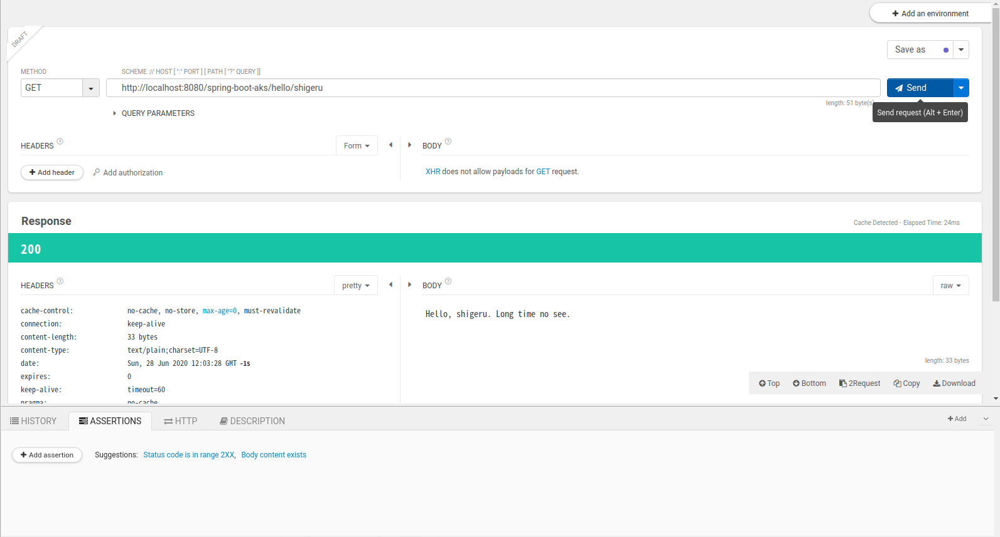

## サンプルの AKS へのデプロイ

### サンプルのビルド

サンプルを AKS にデプロイするためには、まず docker コンテナを作成する必要があります。
spring-boot-aks 直下に移動して、以下のコマンドを実行してサンプル・アプリケーションをビルドします。

```
$ mvn clean install -Dmaven.test.skip=true
[INFO] Scanning for projects...
[INFO] 
[INFO] ----------------< jp.co.softbank.fy20:spring-boot-aks >-----------------
[INFO] Building spring-boot-aks 0.0.1-SNAPSHOT
[INFO] --------------------------------[ jar ]---------------------------------
[INFO] 
[INFO] --- maven-clean-plugin:3.1.0:clean (default-clean) @ spring-boot-aks ---
[INFO] Deleting /home/tatsutas40/git/spring-boot-aks/target
[INFO] 
[INFO] --- maven-resources-plugin:3.1.0:resources (default-resources) @ spring-boot-aks ---
[INFO] Using 'UTF-8' encoding to copy filtered resources.
[INFO] Copying 2 resources
[INFO] Copying 0 resource
[INFO] 
[INFO] --- maven-compiler-plugin:3.8.1:compile (default-compile) @ spring-boot-aks ---
[INFO] Changes detected - recompiling the module!
[INFO] Compiling 7 source files to /home/tatsutas40/git/spring-boot-aks/target/classes
[INFO] 
[INFO] --- maven-resources-plugin:3.1.0:testResources (default-testResources) @ spring-boot-aks ---
[INFO] Not copying test resources
[INFO] 
[INFO] --- maven-compiler-plugin:3.8.1:testCompile (default-testCompile) @ spring-boot-aks ---
[INFO] Not compiling test sources
[INFO] 
[INFO] --- maven-surefire-plugin:2.22.2:test (default-test) @ spring-boot-aks ---
[INFO] Tests are skipped.
[INFO] 
[INFO] --- maven-jar-plugin:3.2.0:jar (default-jar) @ spring-boot-aks ---
[INFO] Building jar: /home/tatsutas40/git/spring-boot-aks/target/spring-boot-sample.jar
[INFO] 
[INFO] --- spring-boot-maven-plugin:2.3.1.RELEASE:repackage (repackage) @ spring-boot-aks ---
[INFO] Replacing main artifact with repackaged archive
[INFO] 
[INFO] --- maven-install-plugin:2.5.2:install (default-install) @ spring-boot-aks ---
[INFO] Installing /home/tatsutas40/git/spring-boot-aks/target/spring-boot-sample.jar to /home/tatsutas40/.m2/repository/jp/co/softbank/fy20/spring-boot-aks/0.0.1-SNAPSHOT/spring-boot-aks-0.0.1-SNAPSHOT.jar
[INFO] Installing /home/tatsutas40/git/spring-boot-aks/pom.xml to /home/tatsutas40/.m2/repository/jp/co/softbank/fy20/spring-boot-aks/0.0.1-SNAPSHOT/spring-boot-aks-0.0.1-SNAPSHOT.pom
[INFO] ------------------------------------------------------------------------
[INFO] BUILD SUCCESS
[INFO] ------------------------------------------------------------------------
[INFO] Total time:  8.967 s
[INFO] Finished at: 2020-06-28T22:50:03+09:00
[INFO] ------------------------------------------------------------------------
```

target 下に spring-boot-sample.jar という名前の jar ファイルが作成されていることを確認します。

```
$ ls -l target
合計 34464
drwxrwxr-x 3 tatsutas40 tatsutas40     4096  6月 28 22:50 classes
drwxrwxr-x 3 tatsutas40 tatsutas40     4096  6月 28 22:49 generated-sources
drwxrwxr-x 2 tatsutas40 tatsutas40     4096  6月 28 22:50 maven-archiver
drwxrwxr-x 3 tatsutas40 tatsutas40     4096  6月 28 22:49 maven-status
-rw-rw-r-- 1 tatsutas40 tatsutas40 35261005  6月 28 22:50 spring-boot-sample.jar
-rw-rw-r-- 1 tatsutas40 tatsutas40    10119  6月 28 22:50 spring-boot-sample.jar.original
```

### サンプルのコンテナの作成

jar ファイルを docker の下にコピーし、コンテナをビルドします。tag に指定する team0registory
は自分のチームの ACR 名を指定するようにしてください。

```
$ cp target/spring-boot-sample.jar src/main/docker/
$ cd src/main/docker/
$ docker build --tag=team0registory.azurecr.io/aks-sample/spring-boot-sample:0.0.1 .
Sending build context to Docker daemon  35.27MB
Step 1/16 : FROM azul/zulu-openjdk-alpine:11.0.7 AS java-build
 ---> 02aa98c5b8f0
Step 2/16 : WORKDIR /jlink
 ---> Running in 876252cc24bb
Removing intermediate container 876252cc24bb
 ---> 235917ae95a9
Step 3/16 : ENV PATH $JAVA_HOME/bin:$PATH
 ---> Running in c6cbbf5e8904
Removing intermediate container c6cbbf5e8904
 ---> 68bdb4b7116d
Step 4/16 : RUN jlink --strip-debug --no-header-files --no-man-pages --compress=2 --module-path $JAVA_HOME     --add-modules java.base,java.logging,java.xml,jdk.unsupported,java.sql,java.naming,java.desktop,java.management,java.security.jgss,java.instrument,jdk.localedata     --include-locales=en,ja,*-IN     --output jre-min
 ---> Running in 97e0f4f8120e
Removing intermediate container 97e0f4f8120e
 ---> fa5f0006bae6
Step 5/16 : FROM alpine:3.12.0
 ---> a24bb4013296
Step 6/16 : COPY --from=java-build /jlink/jre-min /opt/jre-min
 ---> 0ddc01238d2c
Step 7/16 : ADD spring-boot-sample.jar /tmp/
 ---> 5ecb6eb1ed2a
Step 8/16 : USER root
 ---> Running in 1754fb33487e
Removing intermediate container 1754fb33487e
 ---> fba36ae52c98
Step 9/16 : ENV PATH /opt/jre-min/bin:$PATH
 ---> Running in ca63ab15e12a
Removing intermediate container ca63ab15e12a
 ---> 8c9885caa4ea
Step 10/16 : ENV APP_HOME /opt/spring-boot
 ---> Running in 4aff99c90922
Removing intermediate container 4aff99c90922
 ---> 77e2a2f05ff9
Step 11/16 : RUN apk add shadow     && mkdir -p ${APP_HOME}/     && useradd spring -m     && chown -R spring:0 ${APP_HOME}     && chmod -R g+rw ${APP_HOME}     && apk add --no-cache tini     && apk add --update --no-cache tzdata     && cp /usr/share/zoneinfo/Asia/Tokyo /etc/localtime      && echo "Asia/Tokyo" > /etc/timezone      && apk del tzdata     && mv /tmp/spring-boot-sample.jar ${APP_HOME}/
 ---> Running in 5836c90568bc
fetch http://dl-cdn.alpinelinux.org/alpine/v3.12/main/x86_64/APKINDEX.tar.gz
fetch http://dl-cdn.alpinelinux.org/alpine/v3.12/community/x86_64/APKINDEX.tar.gz
(1/2) Installing linux-pam (1.3.1-r4)
(2/2) Installing shadow (4.8.1-r0)
Executing busybox-1.31.1-r16.trigger
OK: 8 MiB in 16 packages
fetch http://dl-cdn.alpinelinux.org/alpine/v3.12/main/x86_64/APKINDEX.tar.gz
fetch http://dl-cdn.alpinelinux.org/alpine/v3.12/community/x86_64/APKINDEX.tar.gz
(1/1) Installing tini (0.19.0-r0)
Executing busybox-1.31.1-r16.trigger
OK: 8 MiB in 17 packages
fetch http://dl-cdn.alpinelinux.org/alpine/v3.12/main/x86_64/APKINDEX.tar.gz
fetch http://dl-cdn.alpinelinux.org/alpine/v3.12/community/x86_64/APKINDEX.tar.gz
(1/1) Installing tzdata (2020a-r0)
Executing busybox-1.31.1-r16.trigger
OK: 12 MiB in 18 packages
(1/1) Purging tzdata (2020a-r0)
Executing busybox-1.31.1-r16.trigger
OK: 8 MiB in 17 packages
Removing intermediate container 5836c90568bc
 ---> 0ada32c35395
Step 12/16 : USER spring
 ---> Running in 8f586a868dbd
Removing intermediate container 8f586a868dbd
 ---> 6efef7750148
Step 13/16 : WORKDIR ${APP_HOME}
 ---> Running in fc9730a2d202
Removing intermediate container fc9730a2d202
 ---> 90aebef3b920
Step 14/16 : EXPOSE 8080
 ---> Running in 304d228961da
Removing intermediate container 304d228961da
 ---> 1e6d8cbff06e
Step 15/16 : ENTRYPOINT ["/sbin/tini", "--"]
 ---> Running in 605cba4b15b7
Removing intermediate container 605cba4b15b7
 ---> c66c4d6aab2e
Step 16/16 : CMD ["java", "-jar", "/opt/spring-boot/spring-boot-sample.jar"]
 ---> Running in b27b53f1d68e
Removing intermediate container b27b53f1d68e
 ---> 1ec2faf475aa
Successfully built 1ec2faf475aa
Successfully tagged team0registory.azurecr.io/aks-sample/spring-boot-sample:0.0.1
```

以下のコマンドを実行し、指定したリポジトリ、タグでコンテナが作成されていることを確認します。
ここで、リポジトリ、タグが `<none>` のイメージは必要ないので削除しても問題ありません。

```
$ docker images
REPOSITORY                                                TAG                      IMAGE ID            CREATED              SIZE
team0registory.azurecr.io/aks-sample/spring-boot-sample   0.0.1                    1ec2faf475aa        About a minute ago   134MB
<none>                                                    <none>                   fa5f0006bae6        2 minutes ago        323MB
redis                                                     6.0.5                    235592615444        2 weeks ago          104MB
alpine                                                    3.12.0                   a24bb4013296        4 weeks ago          5.57MB
azul/zulu-openjdk-alpine                                  11.0.7                   02aa98c5b8f0        6 weeks ago          269MB
mcr.microsoft.com/mssql/server                            2017-CU20-ubuntu-16.04   d04f0f18f395        2 months ago         1.46GB
```

### ACR へのログイン

ACR にコンテナ・イメージをプッシュする前に、まず、ACR に docker login を実施しておく必要が
あります。未だ docker login していない場合は、以下のコマンドを実行して docker login します。
ログイン・サーバー、ユーザー名、パスワードは後述のとおり Azure Portal より確認できます。

```
$ docker login https://team0registory.azurecr.io
Username: team0registory
Password: 
WARNING! Your password will be stored unencrypted in /home/tatsutas40/.docker/config.json.
Configure a credential helper to remove this warning. See
https://docs.docker.com/engine/reference/commandline/login/#credentials-store

Login Succeeded
```

### ACR のログイン情報の確認

Azure Portal にログインし、画面上の検索バーで「コンテナ」と入力し、検索を実行します。検索結果の「コンテナー レジストリ」をクリックします。

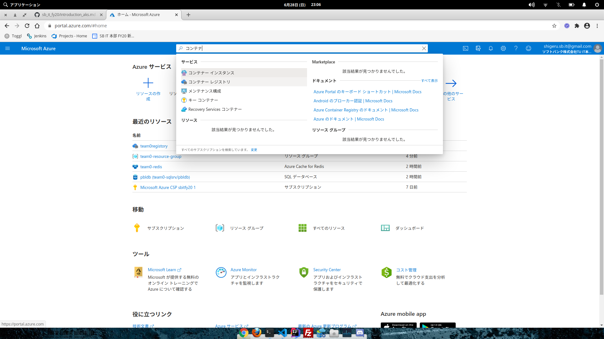

コンテナーレジストリの一覧が表示されるので、自分のチームの ACR のリンクをクリックします。

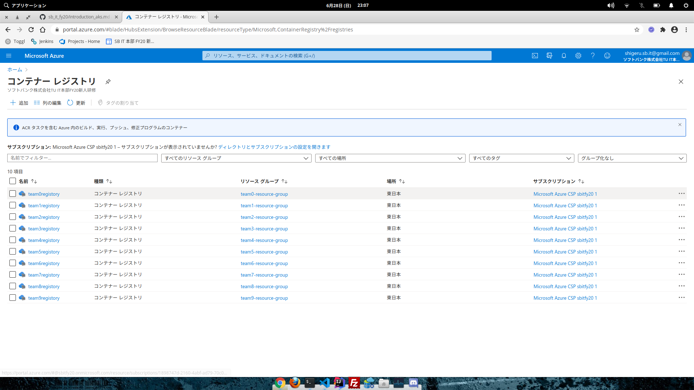

左メニューの「設定」-「アクセスキー」をクリックします。

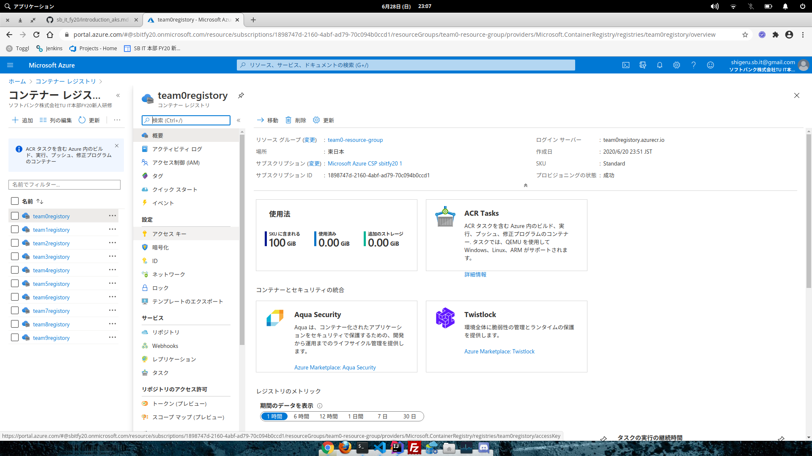

画面で、ログイン・サーバー、ユーザー名、パスワード (password) を確認します。

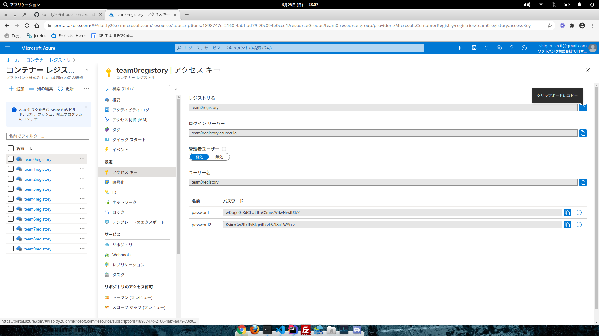

### コンテナ・イメージのプッシュ

ACR に docker login しているなら、以下のコマンドを実行して、コンテナ・イメージをプッシュします。

```
$ docker push team0registory.azurecr.io/aks-sample/spring-boot-sample:0.0.1
The push refers to repository [team0registory.azurecr.io/aks-sample/spring-boot-sample]
51b2b68a6663: Pushed 
f12df877ab35: Pushed 
863c37317c2e: Pushed 
50644c29ef5a: Layer already exists 
0.0.1: digest: sha256:e97bb48c0bf018c35002905d9308bbbfc78539e773979645f2deb4bc0d086516 size: 1164
```

Azure Portal にログインし、ACR の画面にて、左メニューの「サービス」-「リポジトリ」で、ACR にプッシュされているコンテナ・イメージが確認できます。

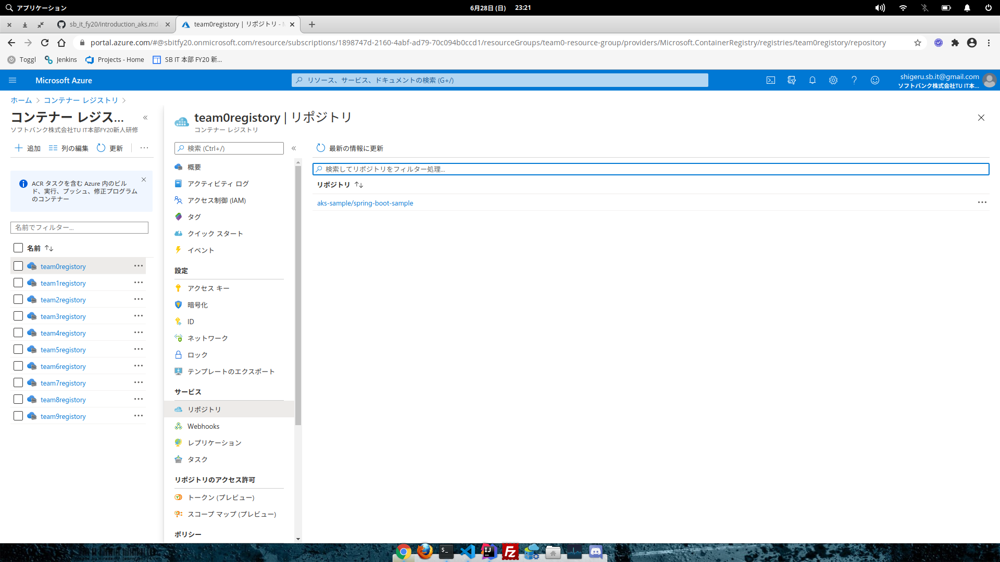

リポジトリのリンクをクリックすることで、タグの一覧も確認できます。

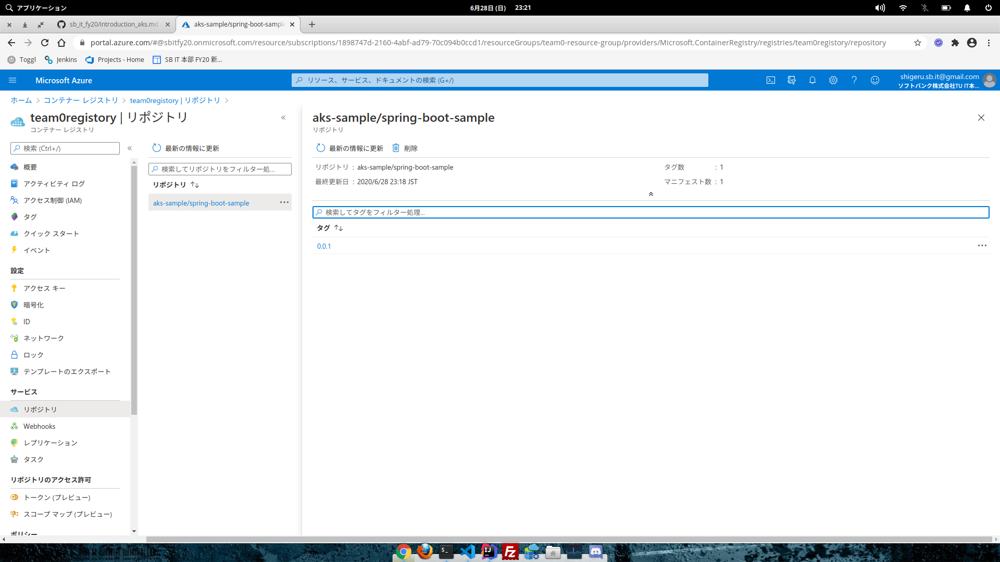

### Kubernetes のマニフェストの編集

spring-boot-aks/src/main/kubernetes 下に移動し、deployment.yml の以下の箇所を自身のチームに合わせて修正します。
具体的に修正する必要があるのは、image のイメージ名、DATASOURCE_URL の SQL サーバ名、REDIS_HOST の Redis ホスト名、および REDIS_PASSWORD のパスワードです。

```
containers:
  - name: aks-sample
    image: team0registory.azurecr.io/aks-sample/spring-boot-sample:0.0.1
    env:
      - name: TZ
        value: JST-9
      - name: JAVA_TOOL_OPTIONS
        value: "-XX:+UseContainerSupport -XX:InitialRAMPercentage=50 -XX:MinRAMPercentage=50 ..."
      - name: SPRING_PROFILES_ACTIVE
        value: "pr"
      - name: DATASOURCE_URL
        value: "jdbc:sqlserver://team0-sqlsrv.database.windows.net:1433;database=pbldb"
      - name: DATASOURCE_USER
        value: "ServerAdmin"
      - name: DATASOURCE_PASSWORD
        value: "welcome1#"
      - name: REDIS_HOST
        value: "team0-redis.redis.cache.windows.net"
      - name: REDIS_PORT
        value: "6379"
      - name: REDIS_PASSWORD
        value: "21AZaO5N0hl92OMbU3M7ANpjrZyx6g9jKqfEpAmzmRk="
```

### Redis のパスワードの確認

Azure Portal にログインし、画面上の検索バーで「Redis」と入力し、検索を実行します。検索結果の「Azure Cache for Redis」をクリックします。

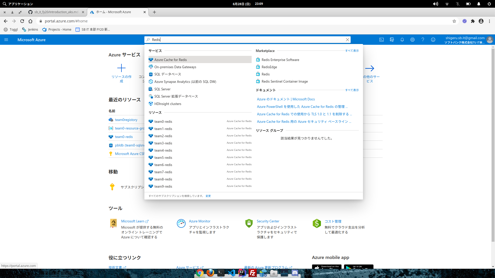

Redis の一覧が表示されるので、自分のチームの Redis のリンクをクリックします。

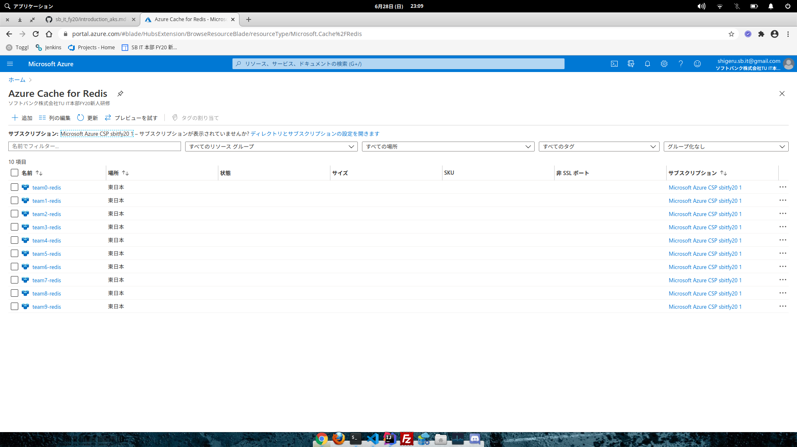

左メニューの「設定」-「アクセスキー」をクリックします。

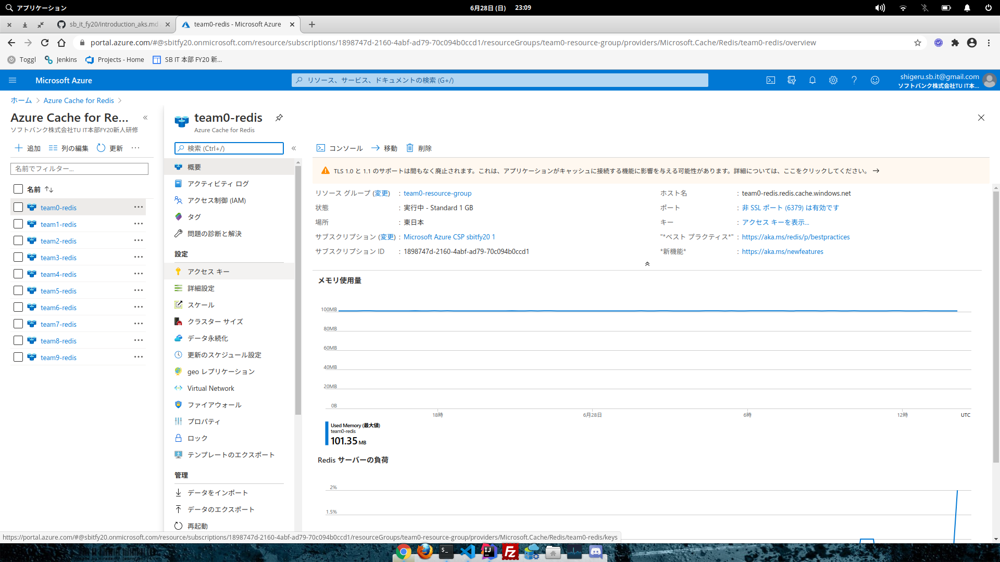

画面で、プライマリに表示されている文字列が Redis のパスワードです。

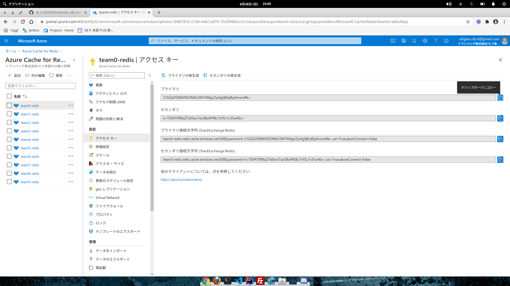

### サービスのデプロイ

以下のコマンドを実行して、サービスをデプロイします。

```
$ kubectl apply -f service.yml 
service/aks-sample created
```

以下のコマンドを実行して、EXTERNAL-IP が割り当てられていることを確認します。
EXTERNAL-IP の割当にはしばらく時間がかかります。

```
$ kubectl get service
NAME         TYPE           CLUSTER-IP    EXTERNAL-IP    PORT(S)        AGE
aks-sample   LoadBalancer   10.0.28.144   20.48.12.190   80:31448/TCP   84s
kubernetes   ClusterIP      10.0.0.1      <none>         443/TCP        7d23h
```

サービスが作成できたら、以下のコマンドを実行してコンテナをデプロイします。
Pod の READY がすべて 1/1 となっていれば準備完了です。

```
$ kubectl apply -f deployment.yml 
deployment.apps/aks-sample created
$ kubectl get deployment
NAME         READY   UP-TO-DATE   AVAILABLE   AGE
aks-sample   3/3     3            3           53s
$ kubectl get pod
NAME                          READY   STATUS    RESTARTS   AGE
aks-sample-55586dff86-h2jn8   1/1     Running   0          55s
aks-sample-55586dff86-npbsv   1/1     Running   0          55s
aks-sample-55586dff86-vmzwc   1/1     Running   0          55s
```

EXTERNAL-IP で割り当てられている IP アドレスに対して、curl、あるいは Talend API Tester でアクセスしてみてください。
